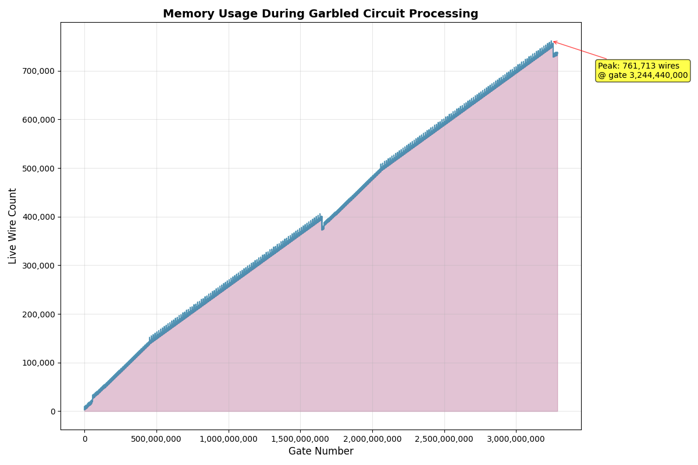

# Garbled Circuits

[](https://opensource.org/licenses/MIT)
[](https://opensource.org/licenses/apache-2-0)
[](https://github.com/alpenlabs/garbled-circuits/actions)

This repo is a research implementation of Garbled Circuits. It currently implements Yao's garbling with Free XOR, but is planned to support other optimizations. It currently accepts bristol fashion format for the description of boolean circuits. The default label size is 128 bits.

## Installation

This repo provides a CLI to for various functions. The CLI can be installed by the following command run from the root of the workspace.

```bash
cargo install --path gc-cli
```

## Features

### Gate Count

  This provides the total gate count along with the distribution of different type of gates.

  ```bash
  gc-cli count dv.bristol
  ```

### Wire Analysis

  This performs wire usage analysis to optimize for memory allocation during garbling and evaluation. This also checks the circuit for any malformed gates. incorrect number of inputs/outputs, etc.
  
  ```bash
  gc-cli wire-analysis dv.bristol
  ```

  The summary of wire-analysis is displayed to stdout and the detailed analysis info is serialized as stored in file dv.wire_analysis

### Memory Simulation

  This is used to simulate memory utilization to ensure that we do not run out of memory storing the intermediate values.

  ```bash
  gc-cli memory-simulation dv.bristol -w dv.wire_analysis -o dv.memory.csv
  ```

  The details are saved to dv.memory.csv which can be plotted using the script `plot_memory_sim.py`

  ```bash
  python3 plot_memory_sim.py dv.memory_sim.csv --output dv.memory.png
  ```

For our dv snark verifier circuit, we have the following plot


It shows that at most 761k out of 3.24 billion gates needs to be kept active. This is only about 0.021% of total wires which is great since at most these many intermediate wire labels needs to be kept in memory.

### Garbling

  Garbles Bristol circuits using Yao's protocol with free XOR optimization. Generates wire labels and garbled truth tables for AND gates.

  ```bash
  gc-cli garble dv.bristol -w dv.wire_analysis -s seed.bin
  ```

  > Note: The random seed file needed to initialize the CSPRNG can be generated using the command.
  > ```bash
  > dd if=/dev/urandom bs=32 count=1 of=seed.bin
  > ```


### OT Simulation

  Simulates oblivious transfer by randomly selecting input wire labels for circuit evaluation.
  This has to be done by a proper OT protocol, It is currently used in this form since we want to get input labels for only one of the two possible bit values for the input wires.

  ```bash
  gc-cli ot-simulate -w dv.labels.json -s seed2.bin -o dv.ot.json
  ```

### Circuit Evaluation

  Evaluates garbled circuits using OT-selected input labels, producing output wire labels and their bit values.

  ```bash
  gc-cli evaluate dv.bristol -w dv.wire_analysis -t dv.ot.json -g dv.garbled
  ```

## DV Circuit

- SHA256 hash: 17446f86cec9a4971dc09cb51359b532e9f48bc003c8e32c098c478df0110ca6
- Total Gates: 3286564142
- AND Gates: 12328132
- XOR Gates: 3274236010
- Total wires: 3286566319
- Primary inputs: 2177
- Intermediate wires: 3285848915
- Primary outputs: 715227
- Missing/unused wires: 0

## Usage

### Complete Garbled Circuit Workflow

```bash
# 1. Analyze wire usage patterns (required for garbling/evaluation)
gc-cli wire-analysis circuit.bristol -o circuit.wire_analysis

# 2. Garble the circuit
gc-cli garble circuit.bristol -w circuit.wire_analysis -s seed.bin

# 3. Simulate OT to select input labels  
gc-cli ot-simulate -w circuit.labels.json -s seed2.bin -o circuit.ot.json

# 4. Evaluate the garbled circuit
gc-cli evaluate circuit.bristol -w circuit.wire_analysis -t circuit.ot.json -g circuit.garbled -o circuit.eval.json
```

### Additional Commands

```bash
# Count gate types
gc-cli count circuit.bristol

# Run memory simulation
gc-cli memory-simulation circuit.bristol -w circuit.wire_analysis -o circuit.memory_sim.csv
```

### Plotting Memory Results

```bash
# Create venv and install dependencies
python3 -m venv plot_venv && source plot_venv/bin/activate
pip install pandas matplotlib

# Generate memory usage plot
python plot_usage_distribution.py circuit.memory.csv --output memory_plot.png
```

## Ciruit Representation

The ciruits are represented in slightly modified bristol fashion format. The original bristol fashion circuit is described [here](https://nigelsmart.github.io/MPC-Circuits/).
The header is modified to only a contain a single line representing number of gates and number of wires. Thus the format looks like

```
<num gates> <num wires>
<in parity> <out parity> <in wire 1> <in wire 2> ... <in wire N> <out wire 1> <out wire 2> <out wire M> <gate type>
```

The second line is repeated to represent all the gates of the circuit in a topological ordering. Two examples also taken from [Prof. Nigel Smart's website](https://nigelsmart.github.io/MPC-Circuits/) and modified to work with the tooling are in the
`example_ckts` directory.

1. [adder64.bristol](https://nigelsmart.github.io/MPC-Circuits/adder64.txt)
2. [mult64.bristol](https://nigelsmart.github.io/MPC-Circuits/mult64.txt)

## Contributing

Contributions are generally welcome.
If you intend to make larger changes please discuss them in an issue
before opening a PR to avoid duplicate work and architectural mismatches.

For more information please see [`CONTRIBUTING.md`](/CONTRIBUTING.md).

## License

This work is dual-licensed under MIT and Apache 2.0.
You can choose between one of them if you use this work.
